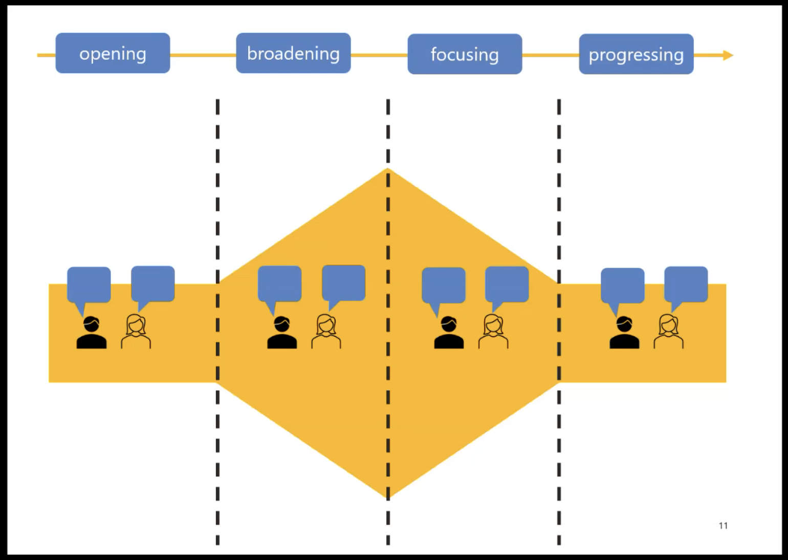
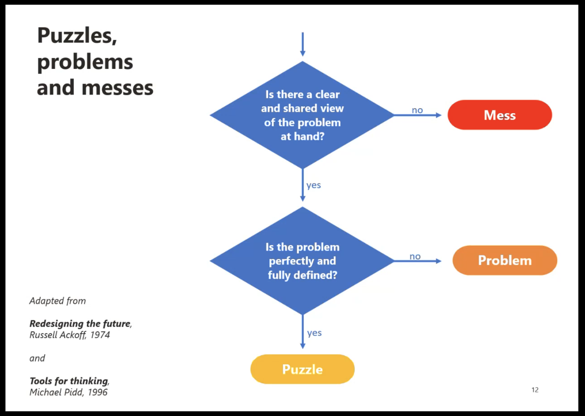
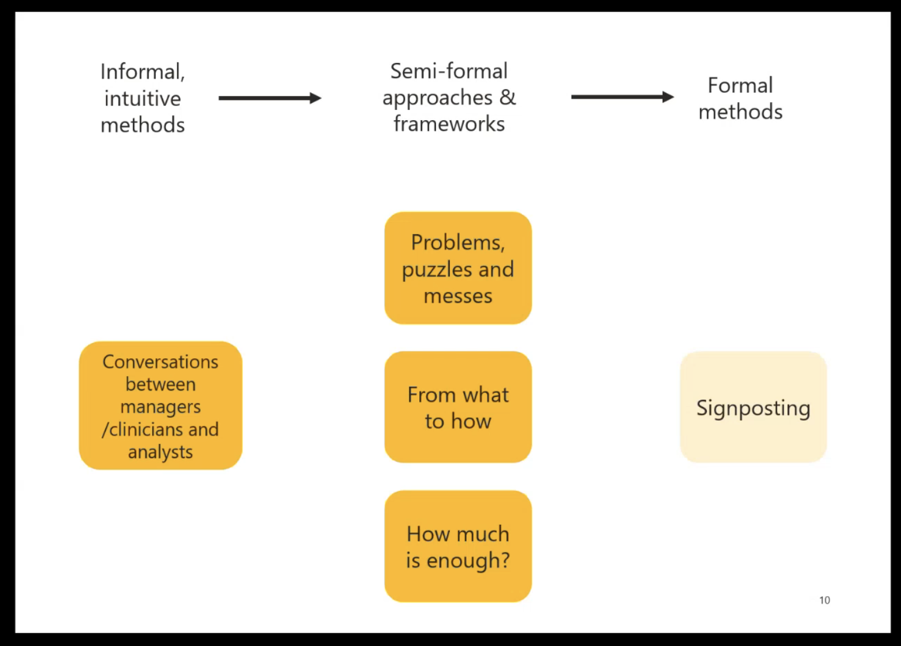
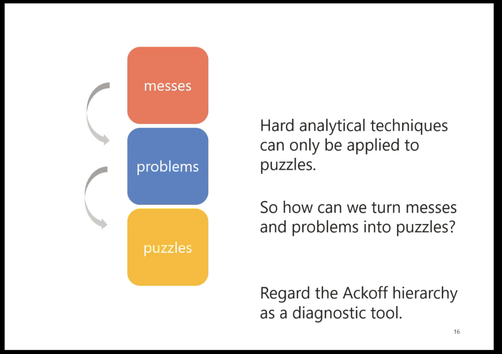
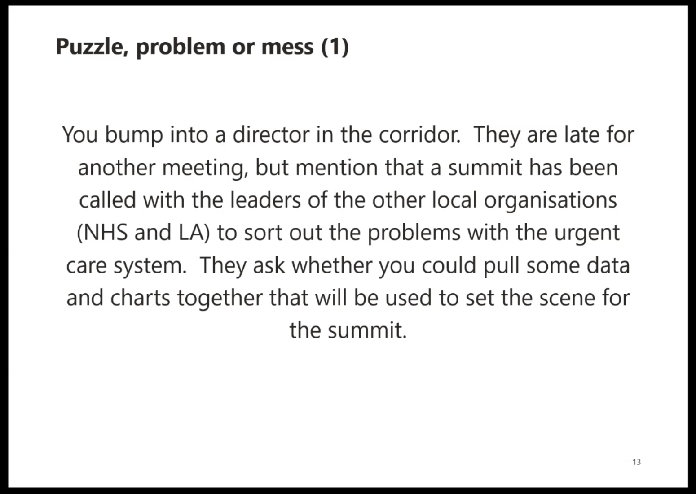
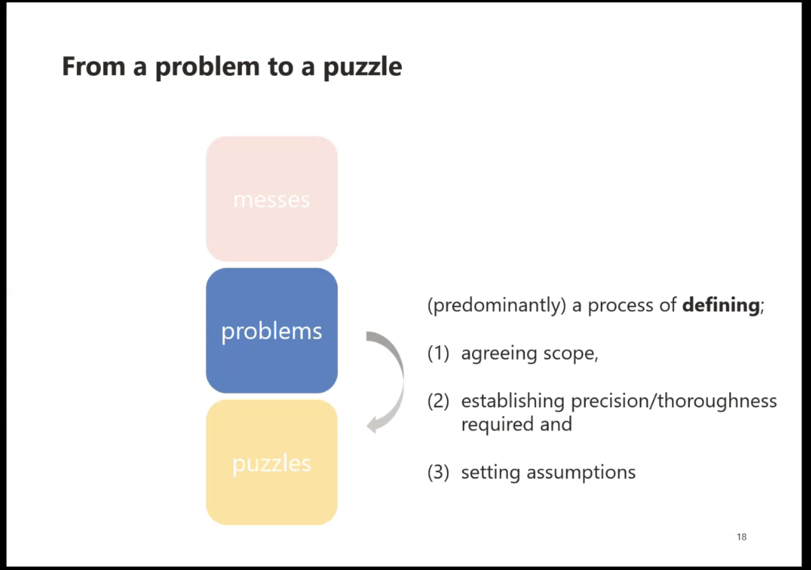
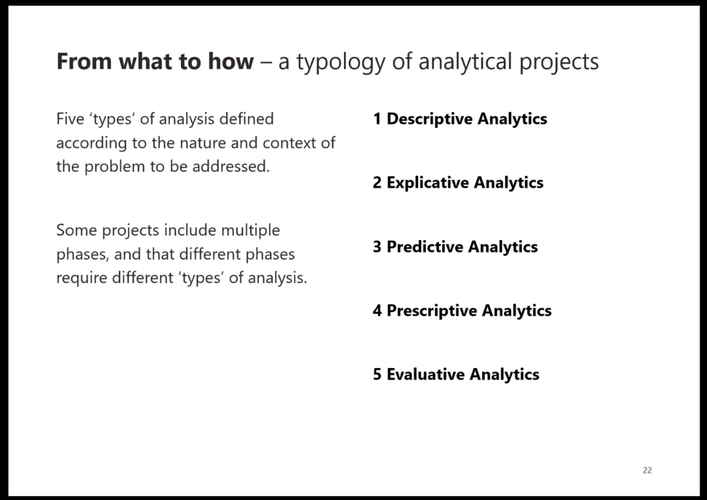
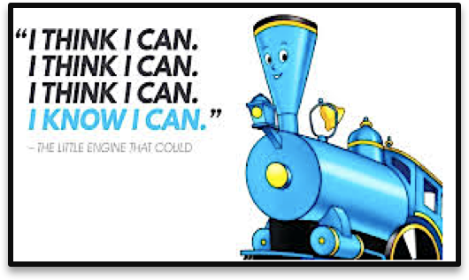
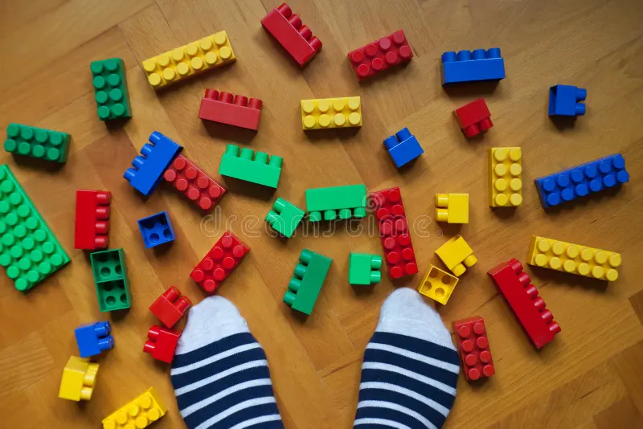

# Problem solving

# Levels of problem solving

## Levels of problem solving

## Levels of problem solving

## Levels of problem solving

## Levels of problem solving

## Levels of problem solving

## Levels of problem solving

## Levels of problem solving

## Levels of problem solving

## Levels of problem solving

# Tenacity/persistence

## Tenacity/persistence

- This is one of the most important qualities of a programmer/CS/coder
- The determination to just get it solved, get something working, will get you through the problem
- There's been loads and loads of times something wasn't working for me, but bloody-minded determination got me through rather than skill

## Tenacity/persistence

- **Tips**
- Your problem almost certainly been solved before
- That means enough searching will get you a (partial) solution
  - (and, yes AI can probably solve it.. More later)
- Take breaks - you'll probably solve it when you come back to it (for some reason)

## Tenacity/persistence

- **Tips**
- Of course, it's easier to be tenacious if you have problem-solving strategies... 

# Breaking down the problem

## Breaking down the problem

- Like we saw in the problem-solving section, the ideal solution is to convert messes to problems to puzzles
- This is the ideal situation, and almost never the case
- At best, we mostly get problems
- So **you** have to impose some structure on things, which usually starts with breaking things down

## Breaking down the problem

- This part is surprisingly easy to forget
  - I always dive in and try to get the whole thing working at once
- Also helps organise your thoughts and think in a "modular" way

# Google searching

# Creativity 

# Collaboration

# Steal code!

# AI

# Resources

[How to think like a computer scientist](https://www.youtube.com/watch?v=sVUda0o98GQ) short video

[How to think like a Computer Scientist](https://runestone.academy/ns/books/published/thinkcspy/index.html) - interactive book with Python code

The Strategy Unit, Steve Wyatt - [An introduction to problem structuring](https://www.youtube.com/watch?v=-X09nvNQkYg) (~50 mins)

[Elements and Principles of Data Analysis](https://www.researchgate.net/publication/331888135_Elements_and_Principles_of_Data_Analysis)

