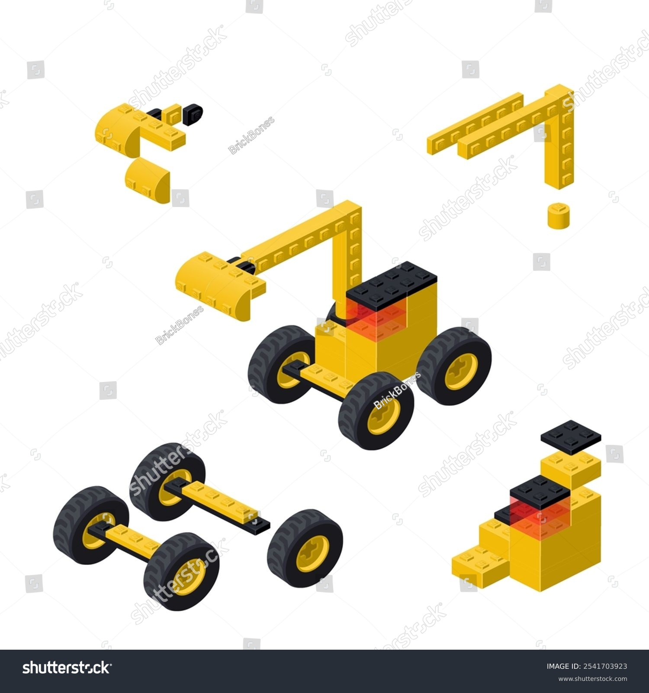
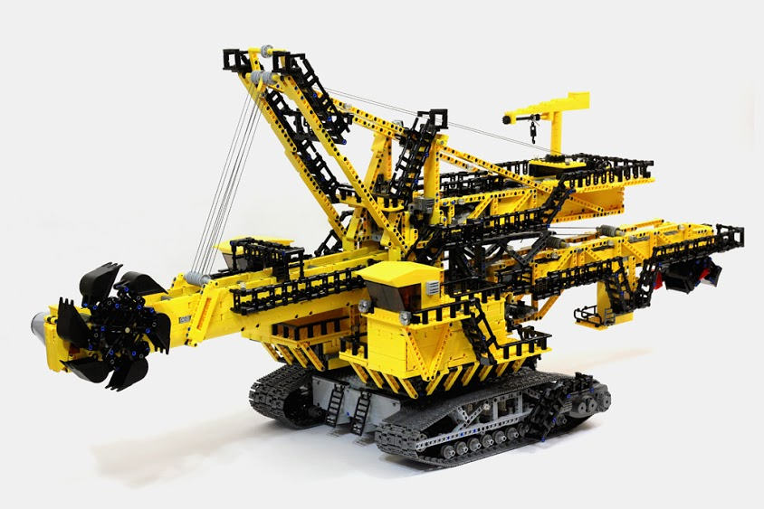

# Problem solving

# Levels of problem solving

## Levels of problem solving

## Levels of problem solving

## Levels of problem solving

## Levels of problem solving

## Levels of problem solving

## Levels of problem solving

## Levels of problem solving

## Levels of problem solving

## Levels of problem solving

# Tenacity/persistence

## Tenacity/persistence

::: columns
::: {.column width="60%"}
- This is one of the most important qualities of a programmer/CS/coder
- The determination to just get it solved, get something working, will get you through the problem
- There's been loads and loads of times something wasn't working for me, but bloody-minded determination got me through rather than skill
:::

::: {.column width="40%"}
{fig-align="right"}
:::
:::

## Tenacity/persistence - **Tips**

::: columns
::: {.column width="60%"}
- Your problem almost certainly been solved before
- That means enough searching will get you a (partial) solution
  - (and, yes AI can probably solve it.. More later)
- Take breaks - you'll probably solve it when you come back to it (for some reason)
:::

::: {.column width="40%"}
{fig-align="right"}
:::
:::

## Tenacity/persistence - **Tips**

::: columns
::: {.column width="60%"}
- Of course, it's easier to be tenacious if you have problem-solving strategies... 
:::

::: {.column width="40%"}
{fig-align="right"}
:::
:::

# Breaking down the problem

## Breaking down the problem

::: columns
::: {.column width="60%"}
- Like we saw in the problem-solving section, the ideal solution is to convert messes to problems to puzzles
- This is the ideal situation, and almost never the case
- At best, we mostly get problems
- So **you** have to impose some structure on things, which usually starts with breaking things down
:::

::: {.column width="40%"}
{fig-align="right"}
:::
:::

## Breaking down the problem

::: columns
::: {.column width="60%"}
- This part is surprisingly easy to forget
  - I always dive in and try to get the whole thing working at once
- Also helps organise your thoughts and think in a "modular" way
  - Useful later for programming design and OOP approaches
:::

::: {.column width="40%"}
{fig-align="right"}
:::
:::   

## Breaking down the problem

- Complex problems can only (efficiently) be built from smaller ones
  - And you have to know how the pieces fit together 

{fig-align="center"}

# Google searching

## Google searching

- Searching for solutions is effectively the way most problems are solved
- There's too much to remember about e.g. the way Python works 
- The search engine is effectively the manual
- Ideas are re-hashed and synthesised into new ones
  - Just like recipes in cookbooks - cooks take one method from here, another ingredient from there, an updated way of doing somehting from another book, all finally combined and interpreted by the individual cook. 
  
{width=300 height=200 .absolute bottom=50 right=0}

## Google searching

- Also there are too many packages out there to learn the specific ways of doing something
- In Python:
  - `numpy`, `matplotlib`, `pandas`, `scikitlearn`... Thousands more!
  
{width=300 height=200 .absolute bottom=50 right=0}

## Google searching - **Tips**

- There is an art to searching, and the more CS vocab you acquire the easier it gets
- Drop error messages directly into a search. These are often explained well or have discussions around them
- Don't give up! Can almost guarantee the same problem is out there somewhere
- Search the smallest level of your problem breakdowns
  - No point in searching "how to build a 3D game in Python"
- Best sites to look out for:
  - Stack Overflow {height=25 width=100}
  - GitHub - especially "Issues" sections {height=25 width=100}
  - Youtube videos {height=25 width=100}
  - Documentation {height=25 width=25}
  - Galleries of example code, especially for graphics [like this one for Plotly](https://plotly.com/python/){target="_blank"}

# Steal code!

## Steal code!

::: columns
::: {.column width="70%"}
- There's no shame in stealing chunks of code from anywhere you can find it
  - Ok, if it's large chunks, then you probably need to at least cite something
  
- But like recipes, you can't really have intellectual property over code "recipes"[^1]
- Code is displayed publicly for you to use, so use it!

- I'm stealing code right now to make these slides from [a talk about PalmerPenguins](https://github.com/apreshill/palmerpenguins-useR-2022/blob/main/index.qmd){target="_blank"}

[^1]: There are probably exceptions to this, so be careful!
:::

::: {.column width="30%"}
{fig-align="right" height=300 width=225}
:::
:::

# Creativity 

# Collaboration

## Collaboration

# AI

- Will start charging soon - Uber model

# Resources

[How to think like a computer scientist](https://www.youtube.com/watch?v=sVUda0o98GQ) short video

[How to think like a Computer Scientist](https://runestone.academy/ns/books/published/thinkcspy/index.html) - interactive book with Python code

The Strategy Unit, Steve Wyatt - [An introduction to problem structuring](https://www.youtube.com/watch?v=-X09nvNQkYg) (~50 mins)

[Elements and Principles of Data Analysis](https://www.researchgate.net/publication/331888135_Elements_and_Principles_of_Data_Analysis)

