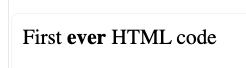
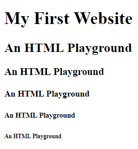
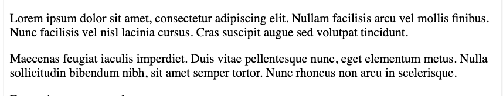
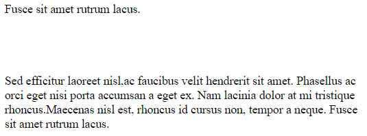

<!-- https://coder-coder.com/how-to-make-simple-website-html/ -->

[Markdown code that generated this file](https://github.com/GaryNapier/city_college/blob/main/11_web_design/html_basics/html_basics.qmd)

## Learning outcomes

- What is HTML?
- Basic HTML syntax
- Basic HTML tags


## What is HTML?
<details>
<summary>Expand</summary>

**HyperText Markup Language**

- A way of displaying information on web pages in your browser.

- Not a *programming* language, but a *markup* language. 

- Programming languages use logic and control flow. 

</details>


## Loading an HTML file in your browser locally
<details>
<summary>Expand</summary>

1. In VSCode - Navigate to the folder where you want your new HTML file to be (**Open Folder**)
2. **File > New File... > Text File**
3. The file should open, now just save it as `index.html`
4. See what the rendered HTML looks like by opening it in the browser (**Right-click > Open with.. > <browser name>**)
  - Or in VSCode you can click "Opn in Integrated Browser" (top right)
  
{style="border: 2px solid lightgrey;"}

  - Drag the `tabs`index.htm` tab down slightly to see your HTML code and the rendered output side-by-side (difficult to get a screenshot of this!)

</details>


## HTML Tags
<details>
<summary>Expand</summary>

HTML is (mostly) made up of tags - bits of code wrapped around text used to "mark up", or distinguish, parts of the web page (hence hypertext *markup* language).

Tell the browser to display whatever is inside the tag in a specific way.

**Example:**

```{html}

First <b>ever</b> HTML code

```

"ever" is in the `<b>` tag, standing for "bold"

Opening tag — `<b>`

Closing tag —  `</b>`

Save the HTML file and reload your browser/VSCode preview. Should look like this:

{style="border: 2px solid lightgrey;"}

</details>


## Basic structure of an HTML document
<details>
<summary>Expand</summary>

But for "proper" HTML on the internet, we need to add more tags to the file for everything to work properly.

### Doctype and HTML tags

The very first tag you need is the `DOCTYPE` tag. 

Not exactly an HTML tag.. It tells the browser that you are using HTML5, ensuring the browser renders the page according to HTML5 specifications ([HTML5](https://en.wikipedia.org/wiki/HTML5)).

`<!DOCTYPE html>`

Doesn't require a closing tag because it's not surrounding any text, just declaring that this is HTML.

Other doctypes used in the past were HTML 4 or XHTML. But now HTML 5 is the only doctype used.

After the doctype, you have an `html` tag telling the browser that everything inside it is HTML:

```{html}

<!DOCTYPE html>
<html>

</html>

```

This seem redundant since we already used the `DOCTYPE` tag. But this other tag ensures that everything inside it will inherit some necessary characteristics of HTML.
  - [S.O. - Why do we need a <html> tag if we have <!DOCTYPE html>?](https://stackoverflow.com/questions/61798106/why-do-we-need-a-html-tag-if-we-have-doctype-html)
  - [S.O - Is it necessary to write HEAD, BODY and HTML tags?](https://stackoverflow.com/questions/5641997/is-it-necessary-to-write-head-body-and-html-tags)

</details>


## `head` and `body` sections
<details>
<summary>Expand</summary>

`head` and `body` tags go inside the main HTML tag:

```{html}

<!DOCTYPE html>
<html>
   <head>
   </head>
   <body>
   </body>
</html>

```

### `head` tag 

- Information about the page  
- Links to CSS and JavaScript files. 

### `body` tag 

- Main content of the page. 
- Everything the user sees on the page will usually be in the body tag. 

So we need to move that sentence "First <b>ever</b> HTML code" into the body.

```{html}

<!DOCTYPE html>
<html>
   <head>
   </head>
   <body>
    First <b>ever</b> HTML code
   </body>
</html>

```

On save and reload, everything should look exactly the same...

</details>


## Basic tags
<details>
<summary>Expand</summary>

There are [lots of tags](https://www.w3schools.com/tags/), so we'll just cover the basics.

### `head` tags

#### Meta-tags

##### UTF-8

The first tag in your head should be this meta-tag setting the character encoding:

```{html}

<meta charset="utf-8">

```

[UTF-8](https://www.w3schools.com/charsets/ref_html_utf8.asp) is a type of Unicode (character set) encoding used in virtually all websites.

The browser needs to translate our letters, numbers, and symbols into the bytes used by computers.

UTF-8 encoding will store `"hello"` like this (binary): `01101000 01100101 01101100 01101100 01101111`

It's like a dictionary, translating human languages into computer-speak.

##### `viewport`

The next meta tag that should be on all websites is the `viewport` tag:

```{html}

<meta name="viewport" content="width=device-width, initial-scale=1, shrink-to-fit=no">

```

Important for **responsive** websites, meaning that the site can display properly on all devices - computers, tablets and phones.

Translation: "Make the width of the website the same width as whatever the device is that is viewing it"

The `initial-scale` sets the zoom. Set at 1 by default, meaning zoomed 100% (not zoomed in or out).

#### Title Tag

Aside from meta tags, one of the most important tags is the title tag:

<title>My First Website</title>

As you can probably guess, this sets the title of the web page. If a website has different pages, each page may have its own title.

Once you’ve added all these tags into your code, this what the head tag should look like:

<head>
   <meta charset="utf-8">
   <meta name="viewport" content="width=device-width, initial-scale=1">
   <title>My First Website</title>
</head>

And you’ll see in your browser that the tab will have what you put in the title tag:

{style="border: 2px solid lightgrey;"}

### `body` tags

body tags control the content that the user actually sees. 

Create headers, bold text, make lists, tables. 

These tags help to organise and stylize your content so it's easier to read. 

Some aren't needed anymore because we can now use CSS, but it's still helpful to know some basic tags. 

#### Header tags

Range from `<h1>` to `<h6>`.

`<h1>` generally used for the title.

Inside `<h1>`, put "My First Website"

Add a subtitle with `<h2>` with the content: "An HTML Playground."

Let’s add in the rest of the `h` tags, up to `<h6>`:

```{html}
<body>
   <h1>My First Website</h1>
   <h2>An HTML Playground</h2>
   <h3>An HTML Playground</h3>
   <h4>An HTML Playground</h4>
   <h5>An HTML Playground</h5>
   <h6>An HTML Playground</h6>
</body>
```

{style="border: 2px solid lightgrey;"}

#### Paragraph

Use paragraphs to separate your content into blocks with `<p>` tags.

Placeholder text: [Lorem ipsum](https://www.lipsum.com/feed/html) - nonsense Latin words often used in publishing and design as dummy text. 

Copy some text and put inside a `<p>` tag, then make a second paragraph.

```{html}
<p>
   Lorem ipsum dolor sit amet, consectetur adipiscing elit. 
   Nullam facilisis arcu vel mollis finibus. Nunc facilisis 
   vel nisl lacinia cursus. Cras suscipit augue sed volutpat 
   tincidunt.
</p>
<p>
   Maecenas feugiat iaculis imperdiet. Duis vitae pellentesque 
   nunc, eget elementum metus. Nulla sollicitudin bibendum nibh, 
   sit amet semper tortor. Nunc rhoncus non arcu in scelerisque. 
</p>
```

Save and refresh:

{style="border: 2px solid lightgrey;"}
#### Line Break

HTML doesn't automatically break lines, so you need to tell it to start a new line. 

Separate content onto multiple lines - `<br>` tag.

Add multiple line breaks to add more space.

```{html}

Fusce sit amet rutrum lacus.<br><br><br><br><br/>
Sed efficitur laoreet nisl,ac faucibus velit hendrerit sit amet. 
Phasellus ac orci eget nisi porta accumsan a eget ex. Nam lacinia 
dolor at mi tristique rhoncus.Maecenas nisl est, rhoncus id cursus 
non, tempor a neque.

```

Save and refresh:

{style="border: 2px solid lightgrey;"}

**NOTE** - the `<br>` tag doesn't need a closing tag. 

The `<br>` tag isn’t used to *surround* text.

Tags that don’t have a closing tag are called **void elements** (because they have no content).

#### Style tags

Bold, italics, underline, emphasized and strong tags.

As before, you can now use CSS to style everything.

Style tags:

`<b>` - **bold**. \
`<i>` - *italic*. \
`<u>` - <u>underlined</u>. \
`<em>` - (emphasise) usually interpreted as *italics* in browsers. \
`<strong>` - usually **bold**. \

```{html}
<b>Sed efficitur laoreet nisl,</b><br> 
<i>ac faucibus velit hendrerit sit amet.</i><br> 
<u>Phasellus ac orci eget nisi porta accumsan a eget ex.</u><br>
<em>Nam lacinia dolor at mi tristique rhoncus.</em><br>
<strong>Maecenas nisl est, rhoncus id cursus non, tempor a neque.</strong>
```

</details>


