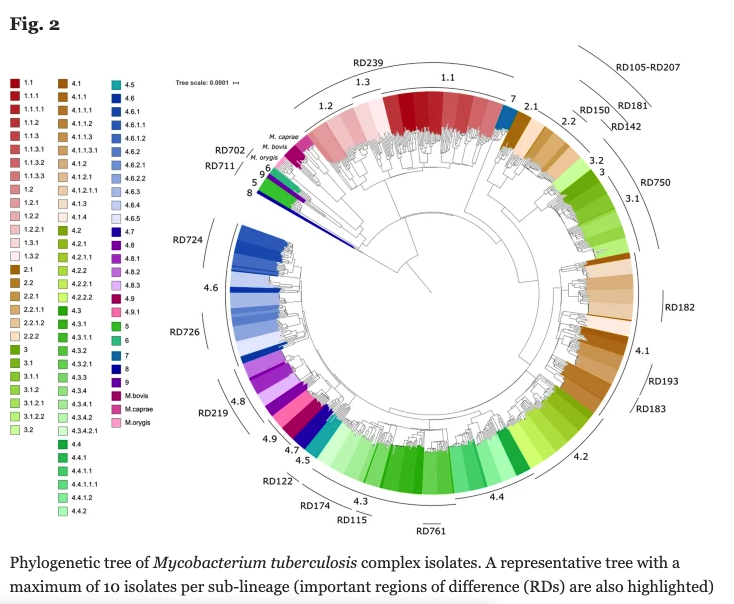
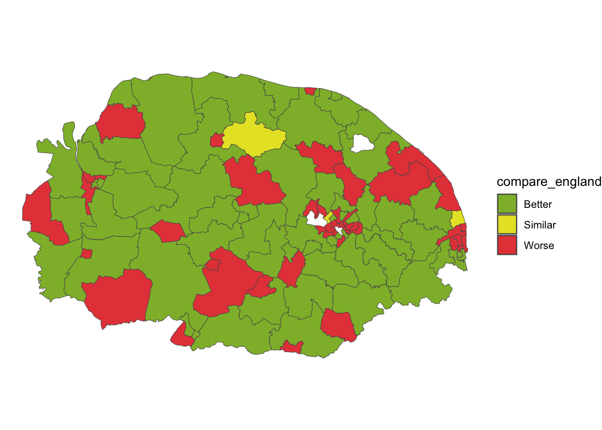

## Introduction

Hello, class!

## Who am I?

### Philosophy - Durham Univ. {width=7%}
  - Logic, philosophy of science, philosophy of mind
  - "Phil. mind is quite interesting... " ->
      

{width=30% fig-align="right"}

## Who am I?

#### Cognitive neuroscience - Institute of Cog. Neuroscience, UCL {width=10%}
  - Computational models of schizophrenia
  - Statistics
  - {width=20%} {width=10%}
  - [Scz. paper](https://discovery.ucl.ac.uk/id/eprint/10056660/)
  - "Need a job..." -> 

{width=40% .absolute bottom=0 right=50}

## Who am I?

#### Customer data analyst - LexisNexis {width=20%}
  - Predicting customer cancellations
    - Exploratory data, prediction modelling/machine learning
  - {width=10%} {width=10%}
  - "Let's learn some proper science and coding..." -> 

## Who am I?

#### *Mycobacterium tuberculosis* research - LSHTM {width=10%}
  - Bioinformatics - using computers to learn about the genome and make inferences about biology
  - {width=15%} {width=10%} {width=20%}
  - other bioinformatics tools and programs
  - [Thesis](https://researchonline.lshtm.ac.uk/id/eprint/4670881/1/2022_ITD_PhD_Napier_G-SR.pdf)
  - "Need a job again..." -> 

{width=20% .absolute bottom=0 right=50}
{width=30% .absolute bottom=175 right=-50}

## Who am I?

#### R programmer - Aviva {width=10%}
  - Developing R Shiny web apps for the actuaries
  - {width=10%} {width=10%} {width=10%} {width=10%}
  - [Shiny gallery](https://shiny.posit.co/r/gallery/)
  - "Need something in public health..." ->

## Who am I?

#### Public health analyst - NHS {width=10%}
  - Analysing public health data, making reports and forecasting for demand or to inform intervention
  - {width=10%} {width=10%} {width=10%}
  - Geosptial data
  - [R epidemiology handbook](https://www.epirhandbook.com/en/)
  
{width=50% .absolute bottom=0 right=50}

