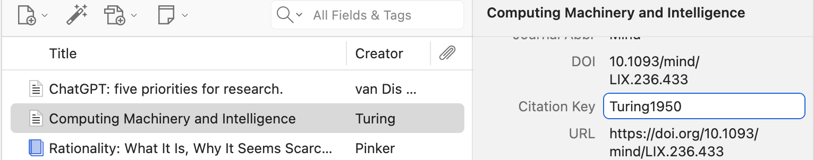
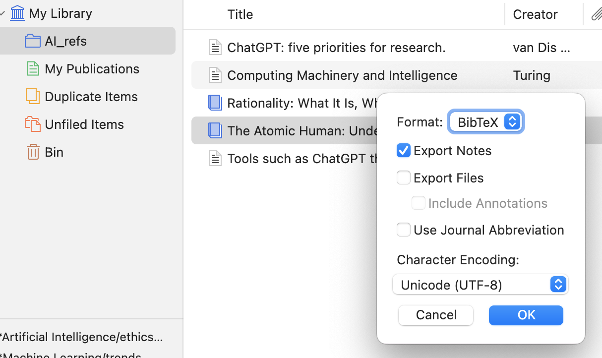
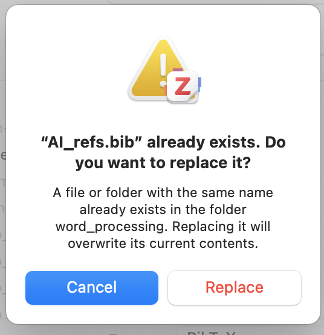

# Referencing in Quarto

[Referencing in Quarto documentation](https://quarto.org/docs/authoring/citations.html)

Now this part is why Quarto is really, really, *really* useful.

Ordinarily a paper is written in a word processor like Word or Google Docs. And we use our reference manager such as Zotero to put our references in my doing **Zotero > Add/Edit reference**. This is fine for most humanities and ordinary documents. 

But it is completely hopeless for *reproducible research*. 

You could keep copying and pasting every number and plot that your code generates, but you will quickly make huge mistakes, and more importantly lose the will to live. 

Quarto allows you to run all your code, and then drop variables, plots and other bits of code into the text AND do all the referencing you need. 

It’s also easier because it’s all done in code, so no more pointing and clicking **Zotero > Add/Edit reference** and going back-and-forth between your word processor and the Zotero application. 

## Setup

### YAML header

You'll see that at the top of this script there is a 'YAML' header:

```
---
title: "Referencing in Quarto"
format: docx
jupyter: python3
bibliography: AI_refs.bib
csl: harvard-cite-them-right.csl
---

```

`title:` - Whatever string you want.

`format:` - How you want the document to be rendered. Options are things like `pdf`, `html` and `docx`. `html` is by far the easiest to deal with and you can drop bits of html code into the Quarto script. Unfortunately professors and institutions are firmly stuck in the past and only generally accept a `docx` file (i.e. a Word document), even though they can be difficult to work with and worse to read than an html page, so that's the option here.

`jupyter:` - This is the engine that converts the Quarto document/Markdown code into whatever format you're running. I don't know too much about the detail of this other than you need `jupyter` and `Python` installed. 

`toc:` - Set to `true` if you want a Table of Contents. 

`bibliography:` - This is the `.bib` file of references you'll need to generate from our Zotero reference list (see below). 

`csl:` - As we're using Harvard Cite Them Right referencing style, Quarto needs a `.csl` file to convert the list of references in the `.bib` file to the correct style formatting. This can be found here - https://github.com/citation-style-language/styles/blob/master/harvard-cite-them-right.csl. 
You'll need a different `.csl` file at university or whoever you're writing for, depending on what format they use. There are thousands and thousands of `.csl` files, one for each journal and, well basically anything you can think of. 
**Put this file in the same directory as the Quarto script otherwise it won't find it**.

There are lots of other options you can put into the YAML header - see [YAML options](https://quarto-tdg.org/yaml) to start with.

### In Zotero

First of all, make sure you have a **Citation Key** in Zotero for each reference you want to use. 

This is a tag that Quarto will use to uniquely refer to that reference in the Markdown code. 

This is pretty much the only manual step you have to do (apart from adding and checking the reference in Zotero), but once it's done it's done. (Sometimes when you download a journal citation, the Citation Key is already there, sometimes not, so you'll need to check. You also need to check in case it clashes with an existing one.)

In Zotero, click on the reference you want, then on the right hand side scroll down to the **Citation Key** field. 

Fill this in with a sensible, unique name. Usually surname and year, no spaces. If an author has more than one paper in a year, then do something like "Smith2007a" and "Smith2007b" in each respective Citation Key.



Now make sure to download the folder as a `.bib` file - **Right click the folder > Export Collection > Make sure Format is BibTeX > OK > Save to the same directory as the Quarto script**. 



If you get another reference you want to include, download the citation into Zotero as usual, add the Citation Key (or you realise you didn't add a Citation Key for an existing ref), then just repeat the step above, exporting the `.bib` file and replacing the existing `.bib` file. 



If you get an error in the terminal saying `[WARNING] Citeproc: citation <Citation Key> not found` then it's likely you haven't downloaded the `.bib` file with the complete list of refs, or you forgot a Citation Key, or there is a mismatch between the Citation Key in Quarto and the `.bib` file. 

## Books

Here you'll use the `@` symbol with the **Citation Key** to tell Quarto we need a reference. 

Basic examples:

With square brackets:

“Machine-generated automation can be traced to the renaissance [@Lawrence2024]..."

Square brackets optional:

“Machine-generated automation can be traced to the renaissance [@Lawrence2024]..."

Add the page number (remember needed for books!):

"Machine-generated automation can be traced to the renaissance [@Lawrence2024, p. 8]..."

Using the author's name as part of the text and referencing by year:

"According to Lawrence [-@Lawrence2024, p. 8] , machine-generated automation can be traced to the renaissance…"


## Journal articles

Much the same as books... examples:

"@Turing1950 says that..."

OR

"Turing [-@Turing1950] says that..."

"According to @Turing1950..."

"The Turing test [@Turing1950] posits that a machine can..."

## Cross-referencing

[Cross referencing in Quarto](https://quarto.org/docs/authoring/cross-references.html)

Here is how to reference figures, tables and equations *within* your document, just like we did in the Google Doc. 

### Figures from saved images

Here is a figure called by specifying its path and giving it a unique tag with the curly braces and `#`:

{#fig-or-gate}

Then you want to refer to this figure in the text like this: 

	“As we can see from the Or-gate diagram (@fig-or-gate)...”

“As we can see from the Or-gate diagram (@fig-or-gate)...”

### Figures from plots/code

Of course, your figures might be output by bits of code if you're automating for reproducibility (which you should!). 

Then we have a code block with the tags for the caption (`fig-cap`) (telling the reader what the figure/plot is) and the unique tag (`label`) so we can refer to it in the text. 

```{python}
#| label: fig-example-python-plot
#| fig-cap: "Example Python plot"

import matplotlib.pyplot as plt
plt.plot([1,23,2,4])
plt.show()
```

Then we reference in the text again: 

    "For example, see @fig-example-python-plot".

"For example, see @fig-example-python-plot".

### Tables

Likewise, we might have tables to reference. 

We can do simple tables in markdown and reference them like this:

| **A** | **B** | **Q** |
|------|------|------|
| T    | T    | T    |
| T    | F    | T    |
| F    | T    | T    |
| F    | F    | F    |

: Or-gate truth table {#tbl-or-gate}

    "See Or-gate truth table @tbl-or-gate."

"See Or-gate truth table (@tbl-or-gate)."

Or, like with plots we can use code to generate or import tables. 

```{python}
#| label: tbl-example-python-table
#| tbl-cap: "Example Python table from code"

from great_tables import GT, md, html
from great_tables.data import islands

islands_mini = islands.head(10)
# Create a display table showing ten of the largest islands in the world
gt_tbl = GT(islands_mini)

# Show the output table
gt_tbl
```

And then reference in-text, as usual:

    "As the table of islands shows (@tbl-example-python-table)..."

"As the table of islands shows (@tbl-example-python-table)..."

(See [Great Tables](https://posit-dev.github.io/great-tables/articles/intro.html) package in Python for making these kinds of tables)

# Resources 

[Quarto official documentation](https://quarto.org/)

[Quarto: The Practical Guide](https://quarto-tdg.org/)

## Bibliography / References 

The full bibliography, formatted according to the `.csl` file, will automatically appear at the bottom of the document, so the last thing you need to do is just put a header saying "Bibliography" or "References".

# References

